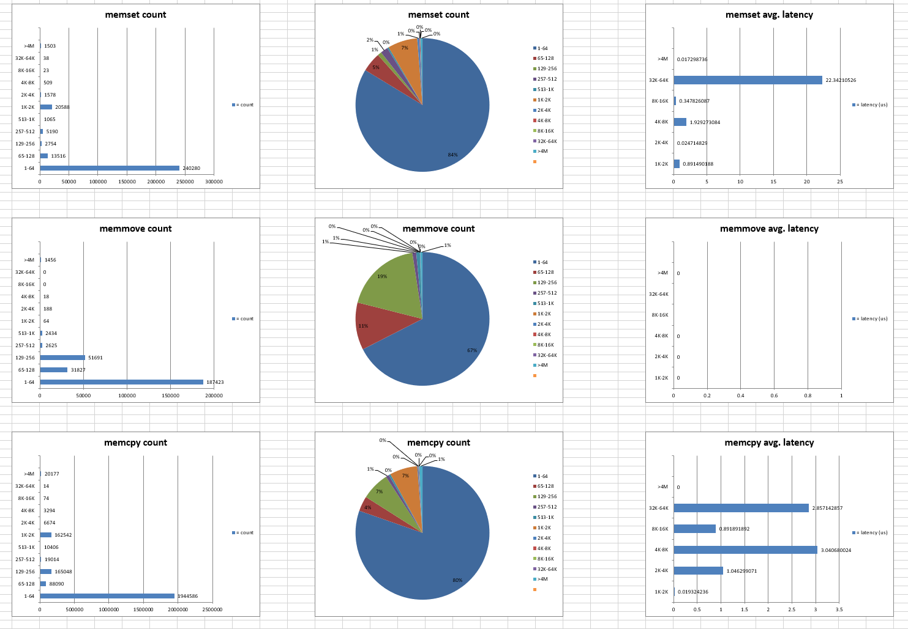
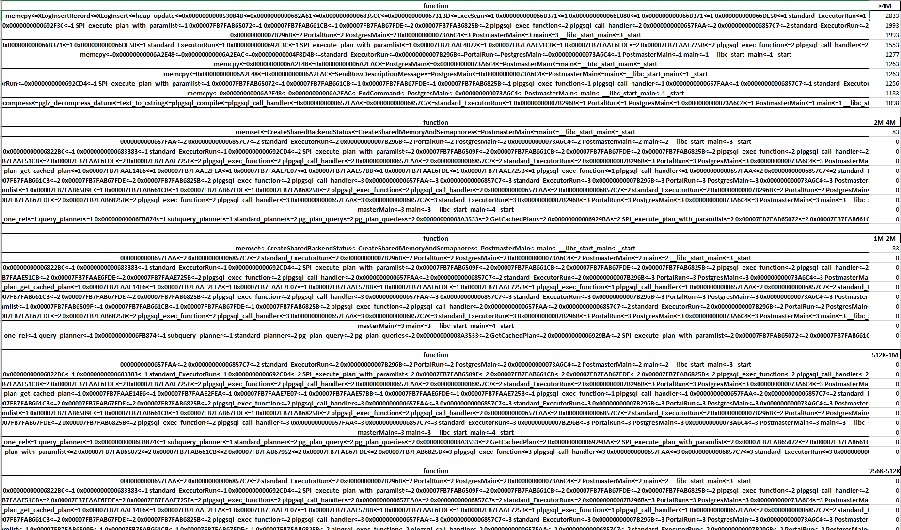

# mstatics 

This tool is used to statistics the C memory function usage. Currently the supported C memory function is memcpy, memset, memmove and malloc. This use the C/C++ LD_PRELOAD to override the C memory function, so that the application code needn't change any code to use the tool.

The statistics result is generated to two excel file. The project provide a tool to generate some pictures to summary the memory function usage in the report file.

Also the tool is able to report the memory function trace stack:

## How to Build

* cd path/to/mstatic/
* make

## Test 
* cd /path/to/mstatic/test
* LD_PRELOAD=/path/to/mstatics/lib/libmstatics.so ./mtest

## How to use
*  LD_PRELOAD=/path/to/mstatics/lib/libmstatics.so *application*

## How to generate the report
* cd /path/to/mstatic/src
* ./processfile.py

## Eviroment variable and Configuration
* MSTATICS_OUT_DIR: this eviroment variable is used to specify the directory for the report to generate. (eg. export MSTATICS_OUT_DIR=./)
* TIMER_TO_LOG: the eviroment variable is used to specify how ofern to flush recorded data to file, the unit is ms. (eg. export TIMER_TO_LOG=1000, means the interval to flush data to file is 1 second)
* The function trace feature can be turn on or turn off by "ENABLE_TRACE" definition in mstatics.hpp

## Known Issue
* If function trace feature is turn on and run the mstatics for MySQL, The startup is very slow due to "dladdr" for trace is the bottelneck
* Since clickhouse replace the glic memcpy by its own memcpy function, we must use the https://github.com/epeshared/dsa_osd/blob/main/clickhouse/memcpy.cpp file to replace the clickhouse memcpy file and then recompile the clickhouse to profile the memcpy

